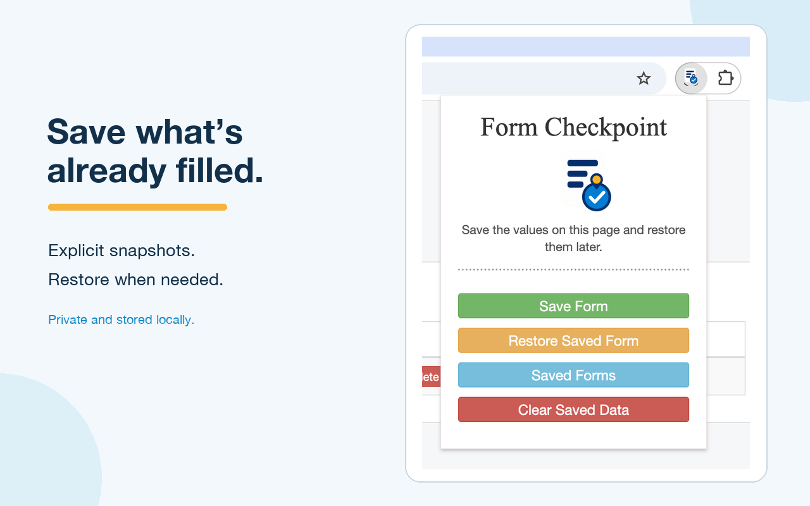
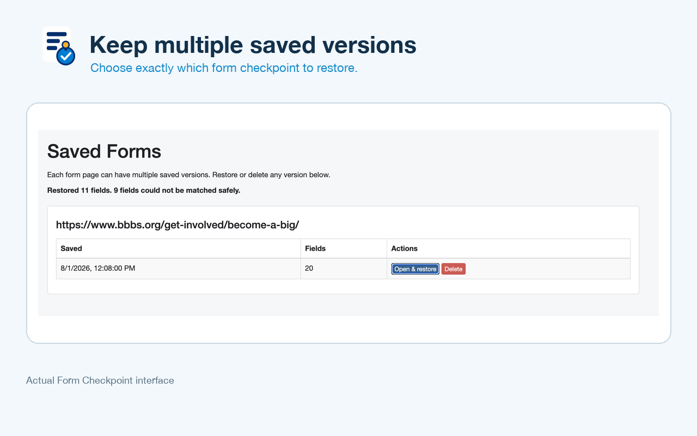

# Form Checkpoint

Save a complete web-form checkpoint and restore it later.

[**Install Form Checkpoint from the Chrome Web Store**](https://chromewebstore.google.com/detail/form-checkpoint/dnlibgkejichiiemiadambeahkmkbcna)

Form Checkpoint is for long applications, surveys, and other forms you do not want to lose. Fill the form normally, then click **Save Form** to create a local checkpoint before you leave, refresh, submit, or make a risky change.

Unlike automatic form-recovery extensions, Form Checkpoint does not continuously monitor everything you type or request permanent access to every website. It reads the active page only after you choose to save or restore.

## Features

- Capture values already present in a tab, including a tab opened before the extension was installed.
- Restore text fields, textareas, selects, checkboxes, radio buttons, repeated fields, and many controlled or conditional forms.
- Keep multiple timestamped versions of the same form.
- Copy a complete checkpoint as readable plain text if a site cannot be restored automatically.
- Store checkpoints locally in Chrome with no account, analytics, or server upload.
- Exclude password, file, and hidden inputs.

## Project status

Form Checkpoint is published in the Chrome Web Store. Its core explicit save-and-restore workflow and Copy All fallback are implemented; broader compatibility improvements remain under consideration.

Development setup and local testing instructions are in [DEVELOPMENT.md](DEVELOPMENT.md). The release and Chrome Web Store update checklist is in [RELEASING.md](docs/RELEASING.md).

See [COMPATIBILITY.md](docs/COMPATIBILITY.md) for current form support and known limits, [PRIVACY.md](PRIVACY.md) for local data handling and permission rationale, and the [roadmap](docs/ROADMAP.md) for explicitly non-committed future ideas.

## Lineage and license

Form Checkpoint is an MIT-licensed fork of [FormVault](https://github.com/drewsb/FormVault), which provided the original template-saving, restoration, and template-management workflow. FormVault also included a legacy change-triggered autosave feature. Form Checkpoint deliberately focuses on explicit user-initiated snapshots: it reads a page only after the user chooses to save or restore, does not continuously monitor typing, and does not require persistent access to every site. The [roadmap](docs/ROADMAP.md) prioritizes Copy All plus `contenteditable` and rich-text compatibility rather than automatic recovery.

Generally useful compatibility and parser improvements are kept separate from Form Checkpoint-specific branding and product changes where practical, so they can be proposed upstream. See the [FormVault upstream pull-request plan](docs/UPSTREAM-PR-PLAN.md) for the conditional contribution sequence.

See [LICENSE](LICENSE) for license details.
